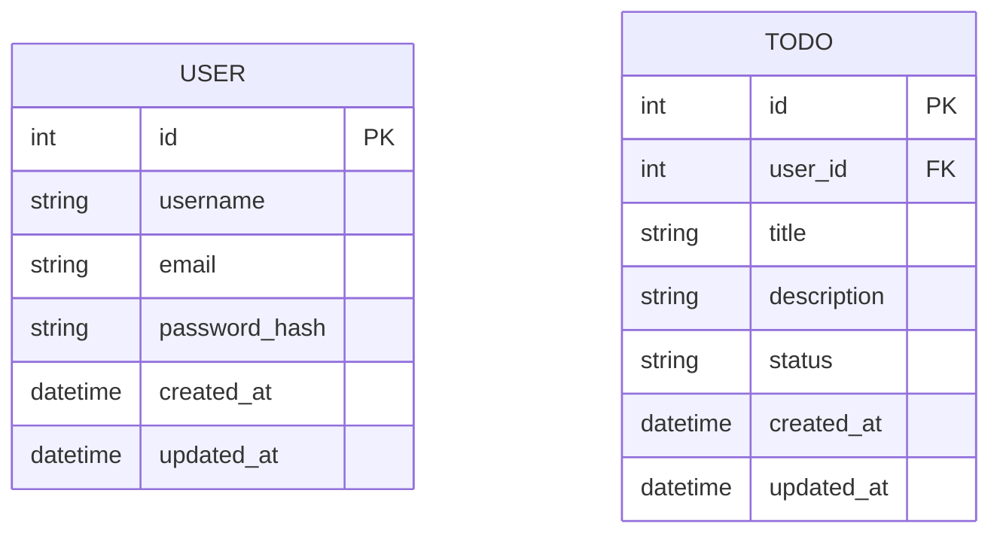
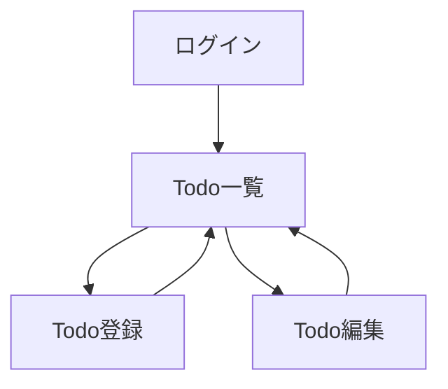

# MyTodoApp 設計書（TypeScript 強化版 + コメント増強）

## 目次

1. [プロジェクト概要](#1-プロジェクト概要)
   1. [アプリ名](#11-アプリ名)
   2. [ディレクトリ構成](#12-ディレクトリ構成)
   3. [目的](#13-目的)
   4. [機能概要](#14-機能概要)
2. [要件定義](#2-要件定義)
   1. [機能要件](#21-機能要件)
   2. [非機能要件](#22-非機能要件)
3. [全体アーキテクチャ](#3-全体アーキテクチャ)
   1. [構成要素](#31-構成要素)
4. [技術選定](#4-技術選定)
   1. [フロントエンド](#41-フロントエンド)
   2. [バックエンド](#42-バックエンド)
   3. [データベース](#43-データベース)
   4. [インフラ (Docker)](#44-インフラ-docker)
   5. [CI/CD](#45-cicd)
5. [各コンポーネントの設計](#5-各コンポーネントの設計)
   1. [フロントエンド](#51-フロントエンド)
   2. [バックエンド](#52-バックエンド)
6. [DB スキーマ設計](#6-db-スキーマ設計)
   1. [user テーブル](#61-user-テーブル)
   2. [todo テーブル](#62-todo-テーブル)
7. [アプリケーション機能仕様](#7-アプリケーション機能仕様)
   1. [画面遷移図](#71-画面遷移図)
   2. [API 仕様例](#72-api-仕様例)
8. [インフラ構成](#8-インフラ構成)
   1. [Docker Compose 構成例](#81-docker-compose-構成例)
   2. [Dockerfile の構成](#82-dockerfile-の構成)
9. [開発環境構築手順](#9-開発環境構築手順)
   1. [リポジトリ・プロジェクトの作成](#91-リポジトリプロジェクトの作成)
   2. [Docker 関連ファイルの準備](#92-docker-関連ファイルの準備)
   3. [Docker Compose でサービス起動](#93-docker-compose-でサービス起動)
10. [実装手順の詳細](#10-実装手順の詳細)
    1. [バックエンド (Express + TypeScript)](#101-バックエンド-express--typescript)
    2. [フロントエンド (React + TypeScript)](#102-フロントエンド-react--typescript)
11. [CI/CD パイプライン設計](#11-cicd-パイプライン設計)
12. [デプロイ戦略](#12-デプロイ戦略)
    1. [開発環境 (local)](#121-開発環境-local)
    2. [ステージング/本番環境へのデプロイ](#122-ステージング本番環境へのデプロイ)
13. [セキュリティ・運用上の考慮](#13-セキュリティ運用上の考慮)
    1. [JWT シークレットキーの安全管理](#131-jwt-シークレットキーの安全管理)
    2. [パスワードのハッシュ化](#132-パスワードのハッシュ化)
    3. [HTTPS 化](#133-https-化)
    4. [ログ管理](#134-ログ管理)
    5. [バックアップ](#135-バックアップ)
    6. [Helmet, Rate-limit などの導入](#136-helmet-rate-limit-などの導入)
14. [今後の拡張方針](#14-今後の拡張方針)
15. [まとめ](#15-まとめ)

## 1. プロジェクト概要

### 1.1 アプリ名

MyTodoApp (仮)

### 1.2 ディレクトリ構成

すでに todo-app/ ディレクトリで管理し、フロントエンド・バックエンドともに TypeScript を使う想定です。
（※各ディレクトリにコメントを追加）

```
todo-app/
  ├─ .gitignore               # Gitでバージョン管理しないファイルを指定
  ├─ .dockerignore            # Dockerビルド時に無視するファイルを指定
  ├─ docker-compose.yml       # Docker Composeでコンテナを構築・起動するための設定ファイル
  ├─ frontend/               # フロントエンド(React + TypeScript)用ディレクトリ
  │   ├─ Dockerfile           # フロントエンドアプリをDockerイメージにするための設定
  │   ├─ package.json         # Node.js（npm）で管理する依存パッケージなど
  │   ├─ tsconfig.json        # TypeScriptコンパイラの設定
  │   ├─ public/              # 公開用リソースを格納 (index.htmlなど)
  │   └─ src/                 # フロントエンドのソースコードディレクトリ
  │       ├─ components/      # UI部品をまとめたコンポーネント
  │       ├─ pages/           # ページ単位でコンポーネントを配置 (例: Todo一覧、ログイン画面など)
  │       ├─ hooks/           # カスタムフック等、共通ロジックをまとめる
  │       ├─ services/        # API呼び出しやビジネスロジックをまとめる
  │       ├─ types/           # TypeScriptの型定義を集約する
  │       ├─ App.tsx          # アプリケーション全体を定義する主要コンポーネント
  │       └─ main.tsx         # Reactアプリのエントリーポイント
  ├─ backend/                # バックエンド(Express + TypeScript)用ディレクトリ
  │   ├─ Dockerfile           # バックエンドアプリをDockerイメージにするための設定
  │   ├─ package.json         # バックエンド側の依存パッケージ
  │   ├─ tsconfig.json        # TypeScriptコンパイラの設定
  │   └─ src/                 # バックエンドのソースコードディレクトリ
  │       ├─ controllers/     # ルート毎の処理 (ビジネスロジック) を定義する
  │       ├─ routes/          # エンドポイント(ルーティング)定義
  │       ├─ models/          # データベースへのアクセスやORM/SQLをまとめる
  │       ├─ middlewares/     # 認証やエラーハンドリング等のミドルウェア
  │       ├─ types/           # バックエンドで使用する型定義
  │       ├─ app.ts           # Expressアプリをセットアップ (ミドルウェア設定など)
  │       └─ server.ts        # アプリを起動し、ポートをListenするエントリーポイント
  └─ db/
      └─ (PostgreSQL データ格納用 Volume など)
```

### 1.3 目的

- React + TypeScript でモダンフロントエンド開発を学ぶ
- Node.js + Express + TypeScript でバックエンド/API 開発を学ぶ
- Docker Compose でマルチコンテナ (フロントエンド、バックエンド、PostgreSQL) を扱う
- GitHub Actions での CI/CD 構築を体験

### 1.4 機能概要

- ログイン / サインアップ (JWT 認証)
- Todo の登録・一覧表示・編集・削除
- ステータス管理 (TODO, DOING, DONE)
- ユーザーごとの Todo 管理 (外部キーで紐付け)

## 2. 要件定義

### 2.1 機能要件

- ユーザー管理 (ログイン、サインアップ、ログアウト)
- Todo CRUD (新規作成, 一覧, 詳細, 更新, 削除)
- ステータスによるフィルタリング
- JWT による認証・認可

### 2.2 非機能要件

- 可用性: 小規模のため最小限
- セキュリティ: JWT 認証、パスワードハッシュ (bcrypt)
- 拡張性: TypeScript + React/Express で保守性を高める
- CI/CD: GitHub Actions でテスト & ビルド

## 3. 全体アーキテクチャ

```mermaid
flowchart LR
    A[ユーザー] --HTTP--> B[フロントエンド (React + TS)]
    B --HTTP/REST--> C[バックエンド (Express + TS)]
    C --SQL--> D[PostgreSQL]
```

### 3.1 構成要素

- フロントエンド: React + TypeScript
- バックエンド: Node.js + Express + TypeScript
- DB: PostgreSQL
- Docker: コンテナでフロント・バック・DB を起動
- GitHub Actions: CI/CD

## 4. 技術選定

### 4.1 フロントエンド

- React + TypeScript
  - UI レンダリング、SPA 構築に強み
  - 型定義による保守性向上

### 4.2 バックエンド

- Node.js + Express + TypeScript
  - JavaScript エコシステムの豊富なライブラリを活用
  - TypeScript により静的型解析を導入し、可読性・安全性 UP

### 4.3 データベース

- PostgreSQL
  - Docker Compose での運用に適し、学習用途にも最適

### 4.4 インフラ (Docker)

- Docker Compose
  - フロントエンド、バックエンド、PostgreSQL を統合管理しやすい

### 4.5 CI/CD

- GitHub Actions
  - リポジトリ連携が容易
  - 無料枠で試せる

## 5. 各コンポーネントの設計

### 5.1 フロントエンド

ディレクトリ構成 (例: すでに 1.2 ディレクトリ構成 に詳述)

- public/: index.html など静的ファイル
- src/: フロントエンド主要ソース
  - components/: 小〜中規模の UI 部品を作成
  - pages/: 各ページ（画面）単位のコンポーネント
  - hooks/: React のカスタムフック
  - services/: API 呼び出し等をまとめる
  - types/: TS の型定義

### 5.2 バックエンド

ディレクトリ構成 (例)

- controllers/: リクエストを受け取り、ビジネスロジックや DB 操作を呼び出してレスポンスする
- routes/: Express のルーティング設定 (app.get("/todos", ...) など)
- models/: DB との連携部分 (Prisma や Sequelize などの ORM を使う場合も)
- middlewares/: JWT 検証やエラーハンドリングをモジュール化
- app.ts: Express アプリを初期化 (ミドルウェア登録など)
- server.ts: ポートを Listen してサーバーを起動

## 6. DB スキーマ設計



### 6.1 user テーブル

| カラム名      | 型       | 概要                 |
| ------------- | -------- | -------------------- |
| id            | int (PK) | 主キー               |
| username      | varchar  | ユーザ名             |
| email         | varchar  | メールアドレス       |
| password_hash | varchar  | パスワードのハッシュ |
| created_at    | datetime | レコード作成日       |
| updated_at    | datetime | レコード更新日       |

### 6.2 todo テーブル

| カラム名    | 型       | 概要                                  |
| ----------- | -------- | ------------------------------------- |
| id          | int (PK) | 主キー                                |
| user_id     | int (FK) | user テーブルへの外部キー             |
| title       | varchar  | Todo のタイトル                       |
| description | text     | Todo の詳細説明                       |
| status      | varchar  | ステータス (todo / doing / done など) |
| created_at  | datetime | レコード作成日                        |
| updated_at  | datetime | レコード更新日                        |

## 7. アプリケーション機能仕様

### 7.1 画面遷移図



### 7.2 API 仕様例

| HTTP Method | エンドポイント | 概要               | リクエスト例                                                                            | レスポンス例                                                 |
| ----------- | -------------- | ------------------ | --------------------------------------------------------------------------------------- | ------------------------------------------------------------ |
| POST        | /auth/signup   | 新規ユーザー作成   | { "username": "aaa", "email": "a@a.com", "password": "pass" }                           | 200 OK, { "message": "User created" }                        |
| POST        | /auth/login    | ログイン(JWT 取得) | { "email": "a@a.com", "password": "pass" }                                              | 200 OK, { "token": "<jwt_token>" }                           |
| GET         | /todos         | Todo 一覧取得      | Authorization: Bearer <jwt>                                                             | 200 OK, [{"id":1, "title":"foo", "status":"todo", ...}, ...] |
| GET         | /todos/:id     | Todo 詳細取得      | Authorization: Bearer <jwt>                                                             | 200 OK, {"id":1, "title":"foo", "status":"todo", ...}        |
| POST        | /todos         | Todo 新規作成      | Authorization: Bearer <jwt>, { "title": "foo", "description": "bar", "status": "todo" } | 201 Created, { "id": 1, ... }                                |
| PUT         | /todos/:id     | Todo 更新          | Authorization: Bearer <jwt>, { "title": "foo2", "status": "doing" }                     | 200 OK, { "message": "Todo updated" }                        |
| DELETE      | /todos/:id     | Todo 削除          | Authorization: Bearer <jwt>                                                             | 200 OK, { "message": "Todo deleted" }                        |

## 8. インフラ構成

### 8.1 Docker Compose 構成例

```bash
todo-app/
  ├─ docker-compose.yml  # Dockerコンテナを一括管理するための設定
  ├─ .dockerignore       # Dockerビルド時に無視するファイルやディレクトリを指定
  ├─ .gitignore          # Gitが追跡しないファイルを指定
  ├─ frontend/           # フロントエンド用ディレクトリ
  │   ├─ Dockerfile      # フロントエンドのDockerイメージを作成
  │   └─ ...
  ├─ backend/            # バックエンド用ディレクトリ
  │   ├─ Dockerfile      # バックエンドのDockerイメージを作成
  │   └─ ...
  └─ db/
      └─ (PostgreSQL データ用Volume等)
```

### 8.2 Dockerfile の構成

#### フロントエンド用 Dockerfile (例)

開発環境 (Node.js コンテナ上で npm start)

```dockerfile
# frontend/Dockerfile
# ベースイメージとして、軽量の node:18-alpine を使用
FROM node:18-alpine

# 作業ディレクトリを /app に設定
WORKDIR /app

# package*.json をコピーしてnpm install
COPY package*.json ./
RUN npm install

# ソースコードをすべてコンテナにコピー
COPY . .

# 3000番ポートを公開 (React開発サーバーが使うデフォルトポート)
EXPOSE 3000

# コンテナ起動時に "npm start" でReactアプリを起動
CMD ["npm", "start"]
```

本番環境 (ビルド + Nginx)

```dockerfile
# 1. Build Stage
FROM node:18-alpine AS build
WORKDIR /app
COPY package*.json ./
RUN npm install
COPY . .
RUN npm run build  # buildフォルダを生成

# 2. Production Stage
FROM nginx:alpine
# buildで生成した成果物をnginxの公開ディレクトリにコピー
COPY --from=build /app/build /usr/share/nginx/html
EXPOSE 80
CMD ["nginx", "-g", "daemon off;"]
```

#### バックエンド用 Dockerfile (例)

開発環境 (ts-node を使ったライブ開発)

```dockerfile
# backend/Dockerfile
FROM node:18-alpine

WORKDIR /app

# package*.json をコピーして依存関係をインストール
COPY package*.json ./
RUN npm install

# アプリのソースをすべてコピー
COPY . .

# 4000番ポートを公開 (Expressのデフォルト想定ポート)
EXPOSE 4000

# npx ts-node で src/server.ts を実行（開発時はホットリロードに nodemon を使用してもOK）
CMD ["npx", "ts-node", "src/server.ts"]
```

本番環境 (ビルド済み JS 実行)

```dockerfile
FROM node:18-alpine

WORKDIR /app

COPY package*.json ./
RUN npm install

COPY . .

# TypeScriptをビルドし dist/ ディレクトリを生成
RUN npm run build

EXPOSE 4000

CMD ["node", "dist/server.js"]
```

## 9. 開発環境構築手順

### 9.1 リポジトリ・プロジェクトの作成

```bash
# まずローカルに 'todo-app' ディレクトリを作成
mkdir todo-app
cd todo-app

# Gitでバージョン管理をする場合は init コマンドを実行
git init

# フロントエンドのReact + TypeScriptアプリを自動生成
# ここで生成される 'frontend' フォルダには
# package.jsonやsrcフォルダなどが含まれる
npx create-react-app frontend --template typescript
# ↑ このコマンドにより、Reactプロジェクトが雛形として生成される

# バックエンド (Express + TypeScript) のディレクトリを作成
mkdir backend
cd backend

# Node.jsの初期化
npm init -y
# ここでpackage.jsonが生成される

# 必要なパッケージをインストール (express, cors, jsonwebtoken, bcryptなど)
npm install express cors jsonwebtoken bcrypt dotenv pg
# TypeScriptに必要な型定義や開発用ライブラリをインストール
npm install -D typescript ts-node @types/express @types/node @types/cors @types/jsonwebtoken @types/bcrypt
# ↑ @types/〇〇は型定義ファイル

# tsconfig.jsonを生成 (TypeScriptのコンパイル設定)
npx tsc --init

# 一旦、todo-app直下に戻る
cd ..
```

### 9.2 Docker 関連ファイルの準備

#### 9.2.1 .gitignore を充実させる

.gitignore は、Git にコミットしたくない（すべきでない）ファイルやディレクトリを指定するファイルです。
一般的に、以下のような種類ごとにまとめて記載します。

```bash
# .gitignore (種類ごとにコメントを付けて整理)

########################
# Node関連 (node_modules)
########################
node_modules/
npm-debug.log
yarn.lock
package-lock.json

########################
# TypeScriptビルド成果物
########################
dist/
build/
*.js
*.d.ts

########################
# OS/IDEごとの不要ファイル
########################
.DS_Store  # macOSの不要ファイル
Thumbs.db  # Windowsの不要ファイル
.vscode/
.idea/

########################
# 環境変数ファイル
########################
.env
.env.local
.env.development
.env.production

########################
# ログファイル
########################
*.log
logs/

########################
# Docker関連
########################
docker-compose.override.yml
# ↑override用に使う場合など
```

#### 9.2.2 .dockerignore を充実させる

.dockerignore は、Docker イメージをビルドする際に不要なファイルをコンテナに含めないようにするための設定です。

```bash
# .dockerignore (こちらも種類ごとにコメント)

########################
# Node関連 (ビルド不要なもの)
########################
node_modules
npm-debug.log
yarn-error.log
package-lock.json

########################
# ローカルビルド成果物
########################
dist
build

########################
# Git関連
########################
.git
.gitignore

########################
# OS/IDE関連
########################
.DS_Store
.vscode
.idea

########################
# 環境変数やログ
########################
.env
*.log
```

### 9.3 Docker Compose でサービス起動

```bash
cd todo-app
docker-compose up --build
```

上記コマンドで docker-compose.yml に定義したコンテナ (frontend, backend, db) が一括でビルド・起動されます。

## 10. 実装手順の詳細

### 10.1 バックエンド (Express + TypeScript)

#### 10.1.1 src/db.ts (DB 接続) の例

```typescript
// src/db.ts
// PostgreSQLの接続設定を行うサンプル
import { Pool } from "pg";
import dotenv from "dotenv";

// 環境変数を読み込む
dotenv.config();

// Poolを生成してPostgreSQLに接続する
export const pool = new Pool({
  host: process.env.DB_HOST, // Docker Composeのservice名(db)と合わせる
  user: process.env.DB_USER, // DBユーザ名 (postgresなど)
  password: process.env.DB_PASSWORD, // DBパスワード
  database: process.env.DB_NAME, // データベース名
  port: Number(process.env.DB_PORT || 5432), // デフォルトで5432
});
```

#### 10.1.2 src/server.ts (サーバ起動) の例

```typescript
// src/server.ts
// Expressアプリをポート4000で起動するサンプルコード
import express from "express";
import cors from "cors";
import { json } from "body-parser";
import dotenv from "dotenv";

dotenv.config(); // .envファイルの読み込み

const app = express();

// CORSの有効化 (フロントとバックのドメインが異なる時に必要)
app.use(cors());

// JSONボディをパースするためのミドルウェア
app.use(json());

// 簡単なルートの例
app.get("/", (req, res) => {
  res.send("Hello from backend in TypeScript!");
});

// ポート番号は環境変数から取得し、なければ4000
const PORT = process.env.PORT || 4000;

// アプリを指定したポートでListen
app.listen(PORT, () => {
  console.log(`Server running on port ${PORT}`);
});
```

（上記以外に、controllers, routes, middlewares などを作成し、複数ファイルに分割して管理する想定）

### 10.2 フロントエンド (React + TypeScript)

#### 10.2.1 プロジェクト生成コマンド

```bash
# フロントエンドの雛形をReact + TypeScriptで生成
# create-react-appを使うとsrc/配下にApp.tsxなどが作られる
npx create-react-app frontend --template typescript
```

これにより、frontend/ ディレクトリが作成され、React + TypeScript 環境が準備されます。

#### 10.2.2 src/services/api.ts (axios 設定) の例

```typescript
// src/services/api.ts
// フロントエンドからバックエンド(API)へHTTPリクエストを送るためのaxios設定

import axios from "axios";

const apiClient = axios.create({
  baseURL: process.env.REACT_APP_API_URL || "http://localhost:4000",
});

// リクエストを送る前に、ローカルストレージからJWTトークンを取得して
// Authorizationヘッダに付与するインターセプターを設定
apiClient.interceptors.request.use((config) => {
  const token = localStorage.getItem("token");
  if (token && config.headers) {
    config.headers.Authorization = `Bearer ${token}`;
  }
  return config;
});

export default apiClient;
```

## 11. CI/CD パイプライン設計

例として GitHub Actions を使用した CI の YAML ファイルを記載します。

```yaml
# .github/workflows/ci.yml
# リポジトリ直下の.github/workflows/ディレクトリに配置
# コミットされたタイミングでテストやビルドを自動実行

name: CI # ワークフローの名前

on:
  push:
    branches: ["main"] # mainブランチへのpush時に起動

jobs:
  build-and-test:
    runs-on: ubuntu-latest # GitHub Actionsが実行されるOS環境

    steps:
      # リポジトリのソースコードを取得
      - name: Check out the repo
        uses: actions/checkout@v2

      # Node.jsのセットアップ
      - name: Set up Node
        uses: actions/setup-node@v2
        with:
          node-version: 18

      # フロントエンドのビルド・テスト
      - name: Build Frontend
        run: |
          cd frontend
          npm install
          npm run build
          # npm run test  # テストコマンドがあればコメントアウト解除

      # バックエンドのビルド・テスト
      - name: Test Backend
        run: |
          cd backend
          npm install
          npm run build  # TypeScriptをコンパイル
          npm test       # テストがあれば実行

      # Dockerイメージのビルド＆プッシュ例 (GitHub Container Registryなどを利用)
      - name: Docker Build & Push
        uses: docker/build-push-action@v2
        with:
          context: ./backend
          tags: ghcr.io/${{ github.repository }}/mytodoapp-backend:latest
          push: true
```

上記では、フロントエンドとバックエンドのビルドやテストを GitHub Actions 上で実行。
Docker イメージをビルドしてレジストリにプッシュする例も含めています。

## 12. デプロイ戦略

### 12.1 開発環境 (local)

- docker-compose up --build でローカル環境を立ち上げ
- フロント (http://localhost:3000)、バックエンド (http://localhost:4000)、DB (5432)

### 12.2 ステージング/本番環境へのデプロイ

- AWS ECS/Fargate / Azure Container Instances / Google Cloud Run など
- もしくは VPS (AWS Lightsail 等) に Docker Compose 配置
- IaC (Terraform, CloudFormation) による管理検討も可

## 13. セキュリティ・運用上の考慮

### 13.1 JWT シークレットキーの安全管理

- .env ファイルに記載し .gitignore でコミット除外
- 本番では AWS Secrets Manager 等を使用

### 13.2 パスワードのハッシュ化

- bcrypt でソルトを使用
- 平文保存は絶対に NG

### 13.3 HTTPS 化

- 本番は必ず TLS/SSL 化する
- Nginx リバースプロキシやクラウドサービスの SSL ターミネーションを利用

### 13.4 ログ管理

- アクセスログに morgan、アプリログに winston など
- 障害調査や監視ツールとの連携

### 13.5 バックアップ

- PostgreSQL の定期バックアップ (pg_dump など)
- 重要データはリモートストレージへ

### 13.6 Helmet, Rate-limit などの導入

- Express の helmet で HTTP ヘッダ強化
- express-rate-limit で DoS 緩和

## 14. 今後の拡張方針

- UI/UX 強化: Material UI, Tailwind, Chakra UI 等の UI フレームワーク採用
- E2E テスト: Cypress, Playwright でユーザー操作の自動化テスト
- 通知機能: 期限前メール通知・Push 通知など
- ロールベース認可: 管理者・一般ユーザーなど権限分離
- SSR や Next.js などへの切り替え検討

## 15. まとめ

以上のように、.gitignore・.dockerignore を強化し、ディレクトリ構成や Dockerfile / docker-compose.yml / ソースコードにコメントを付け加えたバージョンを提示しました。初心者の方でも、各設定が何を意味しているか理解しながら学習・開発を進めやすくなります。

もしまだ不明点や改善ポイントがあれば、随時追記・修正して「生きた設計書」として育てていってください。頑張ってください！
