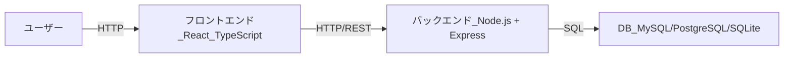
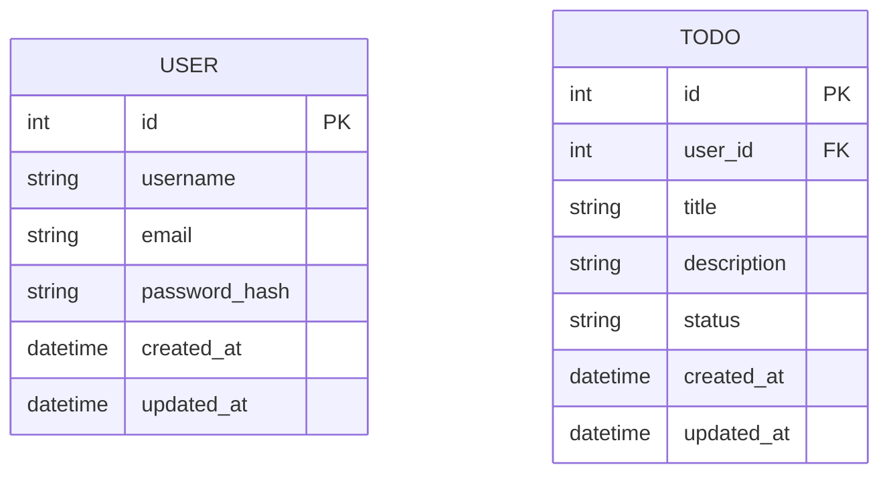
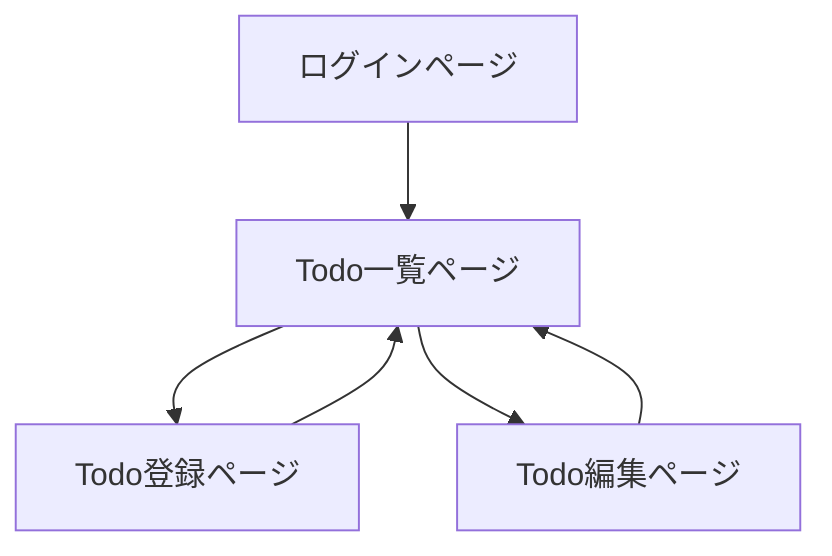

# MyTodoApp 設計書

## 目次

- [プロジェクト概要](#プロジェクト概要)
- [要件定義](#要件定義)
- [全体アーキテクチャ](#全体アーキテクチャ)
- [技術選定](#技術選定)
- [各コンポーネントの設計](#各コンポーネントの設計)
- [DB スキーマ設計](#dbスキーマ設計)
- [アプリケーション機能仕様](#アプリケーション機能仕様)
- [インフラ構成](#インフラ構成)
- [開発環境構築手順](#開発環境構築手順)
- [実装手順の詳細](#実装手順の詳細)
- [CI/CD パイプライン設計](#cicdパイプライン設計)
- [デプロイ戦略](#デプロイ戦略)
- [セキュリティ・運用上の考慮](#セキュリティ運用上の考慮)
- [今後の拡張方針](#今後の拡張方針)
- [まとめ](#まとめ)

## プロジェクト概要

### アプリ名

MyTodoApp (仮)

### 目的

- フロントエンドとバックエンドを含む Web アプリケーション開発の全体像を理解する
- React (TypeScript) を使ったモダンフロントエンド開発に触れる
- Docker でのコンテナ化や簡易的な CI/CD パイプラインの構築を学ぶ
- データベースとの接続や API 設計を行い、バックエンド開発を経験する

### 機能概要

- ログイン機能（簡易認証）
- Todo の登録・閲覧・編集・削除
- ユーザーごとに TODO を管理
- UI 上でのステータス更新、フィルター機能
- 最小限ながらも、フロントエンド・バックエンド・DB すべてを通した仕組みを構築

## 要件定義

### 機能要件

#### ユーザー管理

- ユーザーはサインアップ/ログイン/ログアウトができる

#### Todo 管理

- Todo の新規作成
- Todo の一覧表示
- Todo の詳細表示
- Todo の更新 (タイトル・内容・ステータスなど)
- Todo の削除

#### その他機能

- ステータス管理: TODO, DOING, DONE などのステータス管理ができる
- フィルター機能: ステータスごと、キーワード検索での絞り込みができる

### 非機能要件

#### 可用性

- 小規模アプリであるため最小限。デプロイ後に動作が落ちない程度で OK

#### セキュリティ

- JWT などによる簡易的な認証方式
- パスワードのハッシュ化

#### 拡張性

- React + TypeScript での開発により、大規模化に耐えられる設計にする

#### スケーラビリティ

- Docker を用いたコンテナ化でスケールアップしやすくする

#### CI/CD

- GitHub Actions を用いて、プッシュ時に自動テスト＋ビルドを行い、コンテナをビルドできる形を整備

## 全体アーキテクチャ



### 構成要素

- フロントエンド: React + TypeScript
- バックエンド: Node.js + Express（または Fastify など軽量フレームワーク）
- DB: SQLite や PostgreSQL、MySQL など
  - 学習目的であれば SQLite でも十分だが、Docker で複数コンテナ化する場合は Postgres か MySQL を想定
- インフラ: Docker
- ソースコード管理: GitHub
- CI/CD: GitHub Actions

## 技術選定

### フロントエンド

- **React**
  - 様々なチュートリアルや実績が豊富、学習リソースが多い
- **TypeScript**
  - 型定義により可読性・保守性が上がり、エディタ補完や静的解析が充実

### バックエンド

- **Node.js + Express**
  - シンプルかつ学習コストが低い
  - 多数のサンプル・チュートリアルがある

### データベース

- **PostgreSQL**（あるいは MySQL）
  - Docker での運用がしやすい
  - 本格的な RDB として用途が広く、学習コストも高くない

### インフラ (Docker)

- ローカルマシンでの動作確認やデプロイ環境構築が簡単
- それぞれのサービス（フロントエンド、バックエンド、DB）をコンテナとして分けることで、 拡張性・管理性を高める

### CI/CD

- **GitHub Actions**
  - GitHub リポジトリと統合しやすい
  - 無料枠内で動作検証が可能

## 各コンポーネントの設計

### フロントエンド（React + TypeScript）

#### ディレクトリ構成

```
frontend/
  ├─ public/
  ├─ src/
  │   ├─ components/
  │   ├─ pages/
  │   ├─ hooks/
  │   ├─ services/   ← API クライアントなど
  │   ├─ types/      ← TypeScript の型定義
  │   ├─ App.tsx
  │   └─ main.tsx    ← エントリポイント
  ├─ .env            ← API エンドポイントなど記載
  ├─ package.json
  └─ tsconfig.json
```

#### 主なライブラリ

- react-router-dom (画面遷移)
- axios or fetch API (通信)
- その他 UI ライブラリ（Material UI, Ant Design 等）は好みで追加

### バックエンド（Node.js + Express）

#### ディレクトリ構成

```
backend/
  ├─ src/
  │   ├─ controllers/
  │   ├─ routes/
  │   ├─ models/     ← DB操作 or ORM (Sequelize, Prisma等)
  │   ├─ middlewares/
  │   ├─ app.ts
  │   └─ server.ts   ← サーバ起動ポイント
  ├─ package.json
  └─ tsconfig.json   ← TypeScript設定
```

#### 主なライブラリ

- express
- cors (CORS 制御)
- jsonwebtoken (JWT 認証用)
- bcrypt (パスワードハッシュ化)
- pg or mysql2 (DB 接続)
- prisma or sequelize (ORM を使いたい場合)

## DB スキーマ設計



### user テーブル

| カラム名      | 型       | 概要               |
| ------------- | -------- | ------------------ |
| id            | int (PK) | 主キー             |
| username      | varchar  | ユーザ名           |
| email         | varchar  | メールアドレス     |
| password_hash | varchar  | パスワードハッシュ |
| created_at    | datetime | 作成日             |
| updated_at    | datetime | 更新日             |

### todo テーブル

| カラム名    | 型       | 概要                                  |
| ----------- | -------- | ------------------------------------- |
| id          | int (PK) | 主キー                                |
| user_id     | int (FK) | user テーブルへの外部キ ���           |
| title       | varchar  | Todo のタイトル                       |
| description | text     | Todo の詳細説明                       |
| status      | varchar  | ステータス (todo / doing / done など) |
| created_at  | datetime | 作成日                                |
| updated_at  | datetime | 更新日                                |

## アプリケーション機能仕様

### 画面遷移図



#### ログインページ

- ユーザ名 / メール / パスワードを入力し、ログイン or サインアップ
- 成功時 Todo 一覧ページへ遷移

#### Todo 一覧ページ

- ログインしたユーザーの Todo が一覧表示される
- 新規作成ボタン押下で Todo 登録ページへ
- 編集ボタン押下で Todo 編集ページへ
- 削除ボタン押下で Todo を削除（API 呼び出し）

#### Todo 登録ページ

- タイトル、説明、ステータスを入力して登録
- 登録成功後、Todo 一覧へ戻る

#### Todo 編集ページ

- 既存の Todo を取得して表示、編集して保存
- 保存成功後、Todo 一覧へ戻る

### API 仕様例

| HTTP Method | エンドポイント | 概要               | リクエスト例                                                                            | スポンス例                                                   |
| ----------- | -------------- | ------------------ | --------------------------------------------------------------------------------------- | ------------------------------------------------------------ |
| POST        | /auth/signup   | 新規ユーザー作成   | { "username": "aaa", "email": "a@a.com", "password": "pass" }                           | 200 OK, { "message": "User created" }                        |
| POST        | /auth/login    | ログイン(JWT 取得) | { "email": "a@a.com", "password": "pass" }                                              | 200 OK, { "token": "<jwt_token>" }                           |
| GET         | /todos         | Todo 一覧取得      | Authorization: Bearer <jwt>                                                             | 200 OK, [{"id":1, "title":"foo", "status":"todo", ...}, ...] |
| GET         | /todos/:id     | Todo 詳細取得      | Authorization: Bearer <jwt>                                                             | 200 OK, {"id":1, "title":"foo", "status":"todo", ...}        |
| POST        | /todos         | Todo 新規作成      | Authorization: Bearer <jwt>, { "title": "foo", "description": "bar", "status": "todo" } | 201 Created, { "id": 1, ... }                                |
| PUT         | /todos/:id     | Todo 更新          | Authorization: Bearer <jwt>, { "title": "foo2", "status": "doing" }                     | 200 OK, { "message": "Todo updated" }                        |
| DELETE      | /todos/:id     | Todo 削除          | Authorization: Bearer <jwt>                                                             | 200 OK, { "message": "Todo deleted" }                        |

## インフラ構成

### Docker Compose 構成例

```
mytodoapp/
  ├─ docker-compose.yml
  ├─ frontend/
  │   ├─ Dockerfile
  │   └─ ...
  ├─ backend/
  │   ├─ Dockerfile
  │   └─ ...
  └─ db/
      └─ (データ保存用のVolumeなど)
```

### Dockerfile の ��� 成

#### フロントエンド用 Dockerfile (frontend/Dockerfile)

開発環境用の構成:

```dockerfile
# Node.js を使った軽量イメージ
FROM node:18-alpine

# コンテナ内の作業ディレクトリを設定
WORKDIR /app

# package.json と package-lock.json をコピー
COPY package*.json ./

# 依存関係をインストール
RUN npm install

# ソースコードをコピー
COPY . .

# Reactの開発サーバが使用するポート
EXPOSE 3000

# Reactアプリを起動
CMD ["npm", "start"]
```

本番環境用の構成（Nginx + 最適化ビルド）:

```dockerfile
# 1. Build Stage
FROM node:18-alpine AS build
WORKDIR /app
COPY package*.json ./
RUN npm install
COPY . .
RUN npm run build

# 2. Production Stage
FROM nginx:alpine
# ビルド成果物をNginxの公開ディレクトリへコピー
COPY --from=build /app/build /usr/share/nginx/html

# Nginx が使う80番を開ける
EXPOSE 80

# Nginxをフォアグラウンド起動
CMD ["nginx", "-g", "daemon off;"]
```

#### バックエンド用 Dockerfile (backend/Dockerfile)

開発環境用の構成（ts-node による直接実行）:

```dockerfile
FROM node:18-alpine

WORKDIR /app

COPY package*.json ./

RUN npm install

COPY . .

# 4000番をAPIサーバ用ポートとして開放
EXPOSE 4000

# サーバを起動
CMD ["npx", "ts-node", "src/server.ts"]
```

本番環境用の構成（TypeScript コンパイル後の実行）:

```dockerfile
FROM node:18-alpine

WORKDIR /app

COPY package*.json ./
RUN npm install

COPY . .

# TypeScript をコンパイル
RUN npm run build  # package.json 内で "build": "tsc" と定義

EXPOSE 4000

# dist/server.js を起動
CMD ["node", "dist/server.js"]
```

注意点：

- 開発環境では、ホットリロードやデバッグのしやすさを重視した構成を採用
- 本番環境では、イメージサイズの最適化やパフォーマンスを重視した構成を採用
- フロントエンドの本番環境では、静的ファイルの配信に特化した Nginx を使用
- バックエンドの本番環境では、TypeScript のコンパイル済みコードを実行

#### docker-compose.yml の例

```yaml
version: "3.8"
services:
  frontend:
    build: ./frontend
    container_name: mytodoapp_frontend
    ports:
      - "3000:3000"
    depends_on:
      - backend
    environment:
      - REACT_APP_API_URL=http://localhost:4000 # backendのURL
    networks:
      - mytodo_network

  backend:
    build: ./backend
    container_name: mytodoapp_backend
    ports:
      - "4000:4000"
    depends_on:
      - db
    environment:
      - DB_HOST=db
      - DB_USER=postgres
      - DB_PASSWORD=postgres
      - DB_NAME=mytodo
      - DB_PORT=5432
    networks:
      - mytodo_network

  db:
    image: postgres:15
    container_name: mytodoapp_db
    environment:
      - POSTGRES_USER=postgres
      - POSTGRES_PASSWORD=postgres
      - POSTGRES_DB=mytodo
    volumes:
      - db_data:/var/lib/postgresql/data
    ports:
      - "5432:5432"
    networks:
      - mytodo_network

volumes:
  db_data:

networks:
  mytodo_network:
    driver: bridge
```

## 開発環境構築手順

### リポジトリのクローン

```bash
git clone https://github.com/<YourUserName>/mytodoapp.git
cd mytodoapp
```

### Docker & Docker Compose のインストール

- Docker 公式サイトなどを参照し、Docker Desktop もしくは Docker Engine + Docker Compose をインストール

### Docker Compose でサービス起動

```bash
docker-compose up --build
```

- 初回は --build オプションでコンテナイメージをビルド
- 正常に起動すれば http://localhost:3000 でフロントエンド、http://localhost:4000 でバックエンドが立ち上がる

## 実装手順の詳細

### バックエンド

#### Express + TypeScript のセットアップ

```bash
mkdir backend
cd backend
npm init -y
npm install express cors jsonwebtoken bcrypt dotenv pg
npm install -D typescript ts-node @types/express @types/node @types/jsonwebtoken @types/bcrypt
npx tsc --init
```

#### src/server.ts の作成

```typescript
import express from "express";
import cors from "cors";
import { json } from "body-parser";
import dotenv from "dotenv";

dotenv.config();

const app = express();
app.use(cors());
app.use(json());

// ルーティング (例)
app.get("/", (req, res) => {
  res.send("Hello from backend!");
});

const PORT = process.env.PORT || 4000;
app.listen(PORT, () => {
  console.log(`Server running on port ${PORT}`);
});
```

#### DB 接続設定 (src/db.ts)

```typescript
import { Pool } from "pg";
import dotenv from "dotenv";

dotenv.config();

export const pool = new Pool({
  host: process.env.DB_HOST,
  user: process.env.DB_USER,
  password: process.env.DB_PASSWORD,
  database: process.env.DB_NAME,
  port: Number(process.env.DB_PORT || 5432),
});
```

### フロントエンド

#### React + TypeScript プロジェクト初期化

```bash
npx create-react-app frontend --template typescript
```

#### API 通信部分作成 (src/services/api.ts)

```typescript
import axios from "axios";

const apiClient = axios.create({
  baseURL: process.env.REACT_APP_API_URL || "http://localhost:4000",
});

export default apiClient;
```

## CI/CD パイプライン設計

### GitHub Actions 設 例 (.github/workflows/ci.yml)

```yaml
name: CI

on:
  push:
    branches: ["main"]

jobs:
  build-and-test:
    runs-on: ubuntu-latest

    steps:
      - name: Check out the repo
        uses: actions/checkout@v2

      - name: Set up Node
        uses: actions/setup-node@v2
        with:
          node-version: 18

      # フロントエンドのビルド・テスト
      - name: Build Frontend
        run: |
          cd frontend
          npm install
          npm run build

      # バックエンドのテスト
      - name: Test Backend
        run: |
          cd backend
          npm install
          npm test

      # Dockerビルド & push
      - name: Log in to GitHub Container Registry
        uses: docker/login-action@v2
        with:
          registry: ghcr.io
          username: ${{ github.actor }}
          password: ${{ secrets.GITHUB_TOKEN }}

      - name: Build and push Docker images
        run: |
          docker build -t ghcr.io/${{ github.repository }}/mytodoapp-frontend:latest ./frontend
          docker push ghcr.io/${{ github.repository }}/mytodoapp-frontend:latest

          docker build -t ghcr.io/${{ github.repository }}/mytodoapp-backend:latest ./backend
          docker push ghcr.io/${{ github.repository }}/mytodoapp-backend:latest
```

## デプロイ戦略

### 開発環境 (local)

- `docker-compose up` でローカルにて全コンテナを起動し、動作確認

### ステージング/本番環境へのデプロイ

- 例: AWS EC2 / ECS / Fargate, Azure Container Instances, Google Cloud Run など
- 本格的には IaC（Infrastructure as Code: Terraform 等）で環境構築
- 小規模であれば、VPS や AWS Lightsail に Docker Compose を配置して直接起動

## セキュリティ・運用上の考慮

### JWT シークレットキーの安全管理

- `.env` に記載し、本番は環境変数管理や Secrets Manager 等を利用

### パスワードのハッシュ化

- bcrypt などでハッシュ化、ソルトを付加

### HTTPS 化

- 本番運用時には TLS(SSL)を導入する (AWS ELB / nginx のリバースプロキシ etc)

### ログ管理

- PM2 や Winston などのロガーでバックエンドのログを取得

### バックアップ

- DB のバックアップスクリプトを定期実行

## 今後の拡張方針

- UI の改善: Material UI などの UI フレームワーク導入
- E2E テスト: Cypress, Playwright などで UI/ブラウザテスト
- スマホ対応: レスポンシブデザインの強化
- 通知機能: Todo 期限前通知 (メール送信や Push 通知)
- 集計機能: 達成率や日別完了数グラフなど
- アクセス制限: RBAC (Role Based Access Control) の導入
- パフォーマンス最適化: SSR (Next.js) や SW キャッシュサービスワーカー導入など

## まとめ

本設計書は、React + TypeScript でのフロントエンド、Node.js + Express でのバックエンド、PostgreSQL の RDB、Docker を使ったコンテナ運用、そして GitHub Actions を利用した CI/CD の一連の流れを最小限の Todo アプリで学習するためのガイドラインです。

以下のステップで学習を進めると効率的です：

1. 最低限の CRUD (Todo だけ) を実装し、フロント〜バック〜DB が一気通貫で動く状態を作る
2. ユーザー認証 (JWT) を導入して、個人の Todo を保護
3. Docker Compose でコンテナ化し、ローカル環境で複数コンテナを起動する
4. GitHub Actions で自動テスト＆ビルドし、コードの品質を担保
5. ステージング/本番環境へのデプロイを行い、リモート環境で動かす

最初は学習コストが高く感じるかもしれませんが、モダンな Web アプリ開発では、これら要素（フロントエンド、バックエンド、DB、コンテナ、CI/CD）はほぼ必須になりつつあります。まずは小さく Todo アプリを作り上げ、成功体験を積むことがキャリアアップの近道となります。
