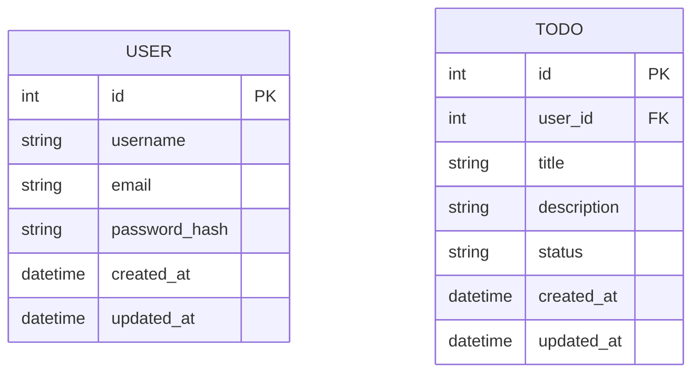
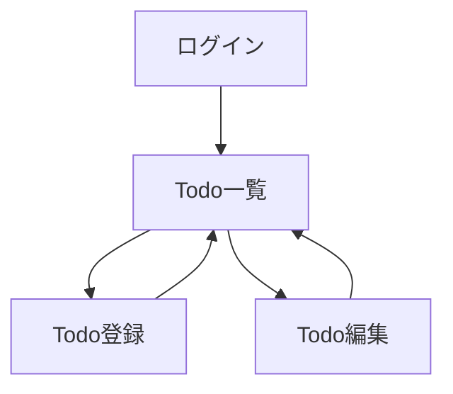

# MyTodoApp 設計書（TypeScript 強化版）

## 目次

1. [プロジェクト概要](#1-プロジェクト概要)
   1. [アプリ名](#11-アプリ名)
   2. [ディレクトリ構成](#12-ディレクトリ構成)
   3. [目的](#13-目的)
   4. [機能概要](#14-機能概要)
2. [要件定義](#2-要件定義)
   1. [機能要件](#21-機能要件)
   2. [非機能要件](#22-非機能要件)
3. [全体アーキテクチャ](#3-全体アーキテクチャ)
   1. [構成要素](#31-構成要素)
4. [技術選定](#4-技術選定)
   1. [フロントエンド](#41-フロントエンド)
   2. [バックエンド](#42-バックエンド)
   3. [データベース](#43-データベース)
   4. [インフラ (Docker)](#44-インフラ-docker)
   5. [CI/CD](#45-cicd)
5. [各コンポーネントの設計](#5-各コンポーネントの設計)
   1. [フロントエンド](#51-フロントエンド)
   2. [バックエンド](#52-バックエンド)
6. [DB スキーマ設計](#6-db-スキーマ設計)
   1. [user テーブル](#61-user-テーブル)
   2. [todo テーブル](#62-todo-テーブル)
7. [アプリケーション機能仕様](#7-アプリケーション機能仕様)
   1. [画面遷移図](#71-画面遷移図)
   2. [API 仕様例](#72-api-仕様例)
8. [インフラ構成](#8-インフラ構成)
   1. [Docker Compose 構成例](#81-docker-compose-構成例)
   2. [Dockerfile の構成](#82-dockerfile-の構成)
9. [開発環境構築手順](#9-開発環境構築手順)
   1. [リポジトリ・プロジェクトの作成](#91-リポジトリプロジェクトの作成)
   2. [Docker 関連ファイルの準備](#92-docker-関連ファイルの準備)
   3. [Docker Compose でサービス起動](#93-docker-compose-でサービス起動)
10. [実装手順の詳細](#10-実装手順の詳細)
    1. [バックエンド (Express + TypeScript)](#101-バックエンド-express--typescript)
    2. [フロントエンド (React + TypeScript)](#102-フロントエンド-react--typescript)
11. [CI/CD パイプライン設計](#11-cicd-パイプライン設計)
12. [デプロイ戦略](#12-デプロイ戦略)
    1. [開発環境 (local)](#121-開発環境-local)
    2. [ステージング/本番環境へのデプロイ](#122-ステージング本番環境へのデプロイ)
13. [セキュリティ・運用上の考慮](#13-セキュリティ運用上の考慮)
    1. [JWT シークレットキーの安全管理](#131-jwt-シークレットキーの安全管理)
    2. [パスワードのハッシュ化](#132-パスワードのハッシュ化)
    3. [HTTPS 化](#133-https-化)
    4. [ログ管理](#134-ログ管理)
    5. [バックアップ](#135-バックアップ)
    6. [Helmet, Rate-limit などの導入](#136-helmet-rate-limit-などの導入)
14. [今後の拡張方針](#14-今後の拡張方針)
15. [まとめ](#15-まとめ)

## 1. プロジェクト概要

### 1.1 アプリ名

MyTodoApp (仮)

### 1.2 ディレクトリ構成

すでに todo-app/ ディレクトリで管理し、フロントエンド・バックエンドともに TypeScript を使う想定です。

```
todo-app/
  ├─ .gitignore
  ├─ .dockerignore
  ├─ docker-compose.yml
  ├─ frontend/
  │   └─ package.json  (React + TypeScript)
  ├─ backend/
  │   └─ package.json  (Express + TypeScript)
  └─ db/
      └─ (PostgreSQL データ格納用 Volume など)
```

### 1.3 目的

- React + TypeScript でモダンフロントエンド開発を学ぶ
- Node.js + Express + TypeScript でバックエンド/API 開発を学ぶ
- Docker Compose でマルチコンテナ (フロントエンド、バックエンド、PostgreSQL) を扱う
- GitHub Actions での CI/CD 構築を体験

### 1.4 機能概要

- ログイン / サインアップ (JWT 認証)
- Todo の登録・一覧表示・編集・削除
- ステータス管理 (TODO, DOING, DONE)
- ユーザーごとの Todo 管理 (外部キーで紐付け)

## 2. 要件定義

### 2.1 機能要件

- ユーザー管理 (ログイン、サインアップ、ログアウト)
- Todo CRUD (新規作成, 一覧, 詳細, 更新, 削除)
- ステータスによるフィルタリング
- JWT による認証・認可

### 2.2 非機能要件

- 可用性: 小規模のため最小限
- セキュリティ: JWT 認証、パスワードハッシュ (bcrypt)
- 拡張性: TypeScript + React/Express で保守性を高める
- CI/CD: GitHub Actions でテスト & ビルド

## 3. 全体アーキテクチャ

```mermaid
flowchart LR
    A[ユーザー] --HTTP--> B[フロントエンド (React + TS)]
    B --HTTP/REST--> C[バックエンド (Express + TS)]
    C --SQL--> D[PostgreSQL]
```

### 3.1 構成要素

- フロントエンド: React + TypeScript
- バックエンド: Node.js + Express + TypeScript
- DB: PostgreSQL
- Docker: コンテナでフロント・バック・DB を起動
- GitHub Actions: CI/CD

## 4. 技術選定

### 4.1 フロントエンド

- React + TypeScript
  - UI レンダリング、SPA 構築に強み
  - 型定義による保守性向上

### 4.2 バックエンド

- Node.js + Express + TypeScript
  - JavaScript エコシステムの豊富なライブラリを活用
  - TypeScript により静的型解析を導入し、可読性・安全性 UP

### 4.3 データベース

- PostgreSQL
  - Docker Compose での運用に適し、学習用途にも最適

### 4.4 インフラ (Docker)

- Docker Compose
  - フロントエンド、バックエンド、PostgreSQL を統合管理しやすい

### 4.5 CI/CD

- GitHub Actions
  - リポジトリ連携が容易
  - 無料枠で試せる

## 5. 各コンポーネントの設計

### 5.1 フロントエンド

ディレクトリ構成 (例)

```
frontend/
  ├─ public/
  ├─ src/
  │   ├─ components/
  │   ├─ pages/
  │   ├─ hooks/
  │   ├─ services/
  │   ├─ types/
  │   ├─ App.tsx
  │   └─ main.tsx
  ├─ package.json
  ├─ tsconfig.json
  └─ .gitignore
```

- services/: API 呼び出し (axios) やビジネスロジック
- components/: 共通コンポーネント
- pages/: 画面単位 (Todo 一覧、ログインなど)

### 5.2 バックエンド

ディレクトリ構成 (例)

```
backend/
  ├─ src/
  │   ├─ controllers/
  │   ├─ routes/
  │   ├─ models/
  │   ├─ middlewares/
  │   ├─ app.ts
  │   └─ server.ts
  ├─ package.json
  ├─ tsconfig.json
  └─ .gitignore
```

- TypeScript で実装するため、tsconfig.json を整備
- controllers/: ユースケースごと (AuthController, TodoController 等)
- routes/: ルーティング定義 (REST API)
- models/: DB 操作 (Prisma や Sequelize、または SQL 直接でも OK)
- middlewares/: JWT 検証、エラーハンドラーなど

## 6. DB スキーマ設計



### 6.1 user テーブル

| カラム名      | 型       | 概要                 |
| ------------- | -------- | -------------------- |
| id            | int (PK) | 主キー               |
| username      | varchar  | ユーザ名             |
| email         | varchar  | メールアドレス       |
| password_hash | varchar  | パスワードのハッシュ |
| created_at    | datetime | レコード作成日       |
| updated_at    | datetime | レコード更新日       |

### 6.2 todo テーブル

| カラム名    | 型       | 概要                                  |
| ----------- | -------- | ------------------------------------- |
| id          | int (PK) | 主キー                                |
| user_id     | int (FK) | user テーブルへの外部キー             |
| title       | varchar  | Todo のタイトル                       |
| description | text     | Todo の詳細説明                       |
| status      | varchar  | ステータス (todo / doing / done など) |
| created_at  | datetime | レコード作成日                        |
| updated_at  | datetime | レコード更新日                        |

## 7. アプリケーション機能仕様

### 7.1 画面遷移図



- ログイン画面
  - メール & パスワードを入力し、JWT を取得
  - サインアップ画面 (または同画面で登録)
- Todo 一覧画面
  - ログイン中のユーザーの Todo を表示
  - 新規作成ボタン → 登録画面へ
  - 編集ボタン → 編集画面へ
  - 削除ボタン → Todo を削除
- Todo 登録画面
  - タイトル、説明、ステータスを入力し登録
  - 登録成功で一覧へ
- Todo 編集画面
  - 既存 Todo を編集
  - 保存成功で一覧へ

### 7.2 API 仕様例

| HTTP Method | エンドポイント | 概要               | リクエスト例                                                                            | レスポンス例                                                 |
| ----------- | -------------- | ------------------ | --------------------------------------------------------------------------------------- | ------------------------------------------------------------ |
| POST        | /auth/signup   | 新規ユーザー作成   | { "username": "aaa", "email": "a@a.com", "password": "pass" }                           | 200 OK, { "message": "User created" }                        |
| POST        | /auth/login    | ログイン(JWT 取得) | { "email": "a@a.com", "password": "pass" }                                              | 200 OK, { "token": "<jwt_token>" }                           |
| GET         | /todos         | Todo 一覧取得      | Authorization: Bearer <jwt>                                                             | 200 OK, [{"id":1, "title":"foo", "status":"todo", ...}, ...] |
| GET         | /todos/:id     | Todo 詳細取得      | Authorization: Bearer <jwt>                                                             | 200 OK, {"id":1, "title":"foo", "status":"todo", ...}        |
| POST        | /todos         | Todo 新規作成      | Authorization: Bearer <jwt>, { "title": "foo", "description": "bar", "status": "todo" } | 201 Created, { "id": 1, ... }                                |
| PUT         | /todos/:id     | Todo 更新          | Authorization: Bearer <jwt>, { "title": "foo2", "status": "doing" }                     | 200 OK, { "message": "Todo updated" }                        |
| DELETE      | /todos/:id     | Todo 削除          | Authorization: Bearer <jwt>                                                             | 200 OK, { "message": "Todo deleted" }                        |

## 8. インフラ構成

### 8.1 Docker Compose 構成例

```
todo-app/
  ├─ docker-compose.yml
  ├─ .dockerignore
  ├─ .gitignore
  ├─ frontend/
  │   ├─ Dockerfile
  │   └─ ...
  ├─ backend/
  │   ├─ Dockerfile
  │   └─ ...
  └─ db/
      └─ (PostgreSQL データ用Volume等)
```

### 8.2 Dockerfile の構成

フロントエンド用 Dockerfile (例)

開発環境:

```dockerfile
# frontend/Dockerfile
FROM node:18-alpine

WORKDIR /app

COPY package*.json ./
RUN npm install

COPY . .

EXPOSE 3000

CMD ["npm", "start"]
```

本番環境 (ビルド + Nginx):

```dockerfile
# 1. Build Stage
FROM node:18-alpine AS build
WORKDIR /app
COPY package*.json ./
RUN npm install
COPY . .
RUN npm run build

# 2. Production Stage
FROM nginx:alpine
COPY --from=build /app/build /usr/share/nginx/html
EXPOSE 80
CMD ["nginx", "-g", "daemon off;"]
```

バックエンド用 Dockerfile (例)

開発環境 (ts-node):

```dockerfile
# backend/Dockerfile
FROM node:18-alpine

WORKDIR /app

COPY package*.json ./
RUN npm install

COPY . .

EXPOSE 4000

CMD ["npx", "ts-node", "src/server.ts"]
```

本番環境 (ビルド済み JS 実行):

```dockerfile
FROM node:18-alpine

WORKDIR /app

COPY package*.json ./
RUN npm install

COPY . .

# TypeScript をビルド
RUN npm run build

EXPOSE 4000

CMD ["node", "dist/server.js"]
```

## 9. 開発環境構築手順

### 9.1 リポジトリ・プロジェクトの作成

todo-app/ を作成し、Git 管理を初期化

```bash
mkdir todo-app
cd todo-app
git init
```

フロントエンド:

```bash
npx create-react-app frontend --template typescript
```

バックエンド (Express + TypeScript):

```bash
mkdir backend
cd backend
npm init -y
npm install express cors jsonwebtoken bcrypt dotenv pg
npm install -D typescript ts-node @types/express @types/node @types/cors @types/jsonwebtoken @types/bcrypt
npx tsc --init
cd ..
```

ルートディレクトリに docker-compose.yml, .dockerignore, .gitignore を作成

### 9.2 Docker 関連ファイルの準備

.gitignore (例):

```bash
# Node modules
node_modules/

# Build outputs
dist/
build/

# Env files
.env
```

.dockerignore (例):

```bash
node_modules
.git
.env
dist
build
```

docker-compose.yml (例):

```yaml
version: "3.8"
services:
  frontend:
    build: ./frontend
    container_name: mytodoapp_frontend
    ports:
      - "3000:3000"
    depends_on:
      - backend
    environment:
      - REACT_APP_API_URL=http://localhost:4000
    networks:
      - mytodo_network

  backend:
    build: ./backend
    container_name: mytodoapp_backend
    ports:
      - "4000:4000"
    depends_on:
      - db
    environment:
      - DB_HOST=db
      - DB_USER=postgres
      - DB_PASSWORD=postgres
      - DB_NAME=mytodo
      - DB_PORT=5432
    networks:
      - mytodo_network

  db:
    image: postgres:15
    container_name: mytodoapp_db
    environment:
      - POSTGRES_USER=postgres
      - POSTGRES_PASSWORD=postgres
      - POSTGRES_DB=mytodo
    volumes:
      - db_data:/var/lib/postgresql/data
    ports:
      - "5432:5432"
    networks:
      - mytodo_network

volumes:
  db_data:

networks:
  mytodo_network:
    driver: bridge
```

### 9.3 Docker Compose でサービス起動

```bash
cd todo-app
docker-compose up --build
```

先にフロントエンド・バックエンドのプロジェクト (package.json) を生成しておくことが重要

起動後:

- フロントエンド: http://localhost:3000
- バックエンド: http://localhost:4000

## 10. 実装手順の詳細

### 10.1 バックエンド (Express + TypeScript)

TypeScript プロジェクト初期化:

- npm init -y + 各ライブラリインストール + tsc --init
- tsconfig.json の調整
  - "target": "ES2020", "moduleResolution": "node", "strict": true など

DB 接続 (例: src/db.ts):

```typescript
import { Pool } from "pg";
import dotenv from "dotenv";

dotenv.config();

export const pool = new Pool({
  host: process.env.DB_HOST,
  user: process.env.DB_USER,
  password: process.env.DB_PASSWORD,
  database: process.env.DB_NAME,
  port: Number(process.env.DB_PORT || 5432),
});
```

サーバ起動 (src/server.ts):

```typescript
import express from "express";
import cors from "cors";
import { json } from "body-parser";
import dotenv from "dotenv";

dotenv.config();
const app = express();

app.use(cors());
app.use(json());

app.get("/", (req, res) => {
  res.send("Hello from backend in TypeScript!");
});

const PORT = process.env.PORT || 4000;
app.listen(PORT, () => {
  console.log(`Server running on port ${PORT}`);
});
```

認証 / Todo API 実装:

- controllers/AuthController.ts にサインアップ・ログイン
- controllers/TodoController.ts に Todo CRUD
- ルータ設定は routes/ ディレクトリでまとめる

型定義:

- interface User や interface Todo を src/types/ に定義して使い回すことで保守性向上

### 10.2 フロントエンド (React + TypeScript)

Create React App (TypeScript):

- すでに npx create-react-app frontend --template typescript で生成済み

ルーティング:

- react-router-dom でページ遷移を管理 (Login, TodoList, TodoEdit など)

axios を使った通信 (src/services/api.ts):

```typescript
import axios from "axios";

const apiClient = axios.create({
  baseURL: process.env.REACT_APP_API_URL || "http://localhost:4000",
});

// JWT をローカルストレージから取得してヘッダに付与
apiClient.interceptors.request.use((config) => {
  const token = localStorage.getItem("token");
  if (token && config.headers) {
    config.headers.Authorization = `Bearer ${token}`;
  }
  return config;
});

export default apiClient;
```

型安全:

- src/types/ ディレクトリで User, Todo などのインターフェイスを定義
- コンポーネントの Props や State、API レスポンスに適切な型を付与

ビルド / デバッグ:

- 開発時: npm start
- 本番ビルド: npm run build → Dockerfile で Nginx イメージ化

## 11. CI/CD パイプライン設計

```yaml
name: CI

on:
  push:
    branches: ["main"]

jobs:
  build-and-test:
    runs-on: ubuntu-latest

    steps:
      - name: Check out the repo
        uses: actions/checkout@v2

      - name: Set up Node
        uses: actions/setup-node@v2
        with:
          node-version: 18

      - name: Build Frontend
        run: |
          cd frontend
          npm install
          npm run build
          # npm run test

      - name: Test Backend
        run: |
          cd backend
          npm install
          npm run build
          npm test

      # Docker build & push (GHCRなど)
      - name: Docker Build & Push
        uses: docker/build-push-action@v2
        with:
          context: ./backend
          tags: ghcr.io/${{ github.repository }}/mytodoapp-backend:latest
          push: true
```

## 12. デプロイ戦略

### 12.1 開発環境 (local)

- docker-compose up --build ですべてのサービスを立ち上げる
- フロント (3000), バックエンド (4000), DB (5432)

### 12.2 ステージング/本番環境へのデプロイ

- AWS ECS/Fargate や Azure Container Instances、Google Cloud Run
- もしくは VPS (AWS Lightsail 等) に直接 Docker Compose 配置
- 本格的には Terraform や CloudFormation で IaC 化

## 13. セキュリティ・運用上の考慮

### 13.1 JWT シークレットキーの安全管理

- .env に記載し .gitignore で除外
- 本番は AWS Secrets Manager 等を利用

### 13.2 パスワードのハッシュ化

- bcrypt で必ずソルトを付与
- 平文保存は絶対にしない

### 13.3 HTTPS 化

- 本番は必ず TLS/SSL 化
- Nginx リバースプロキシやクラウドサービスの SSL ターミネーションを利用

### 13.4 ログ管理

- Winston / Morgan / PM2 など
- 障害調査や監視ツール連携を検討

### 13.5 バックアップ

- PostgreSQL の定期バックアップ (pg_dump, スナップショット)
- 重要データはリモートストレージへ

### 13.6 Helmet, Rate-limit などの導入

- Express で helmet を使い、HTTP ヘッダを強化
- express-rate-limit で DoS 攻撃を緩和

## 14. 今後の拡張方針

- UI/UX 強化: Material UI, Tailwind, Chakra UI 等
- E2E テスト: Cypress, Playwright
- モバイル対応: レスポンシブデザイン
- 通知機能: 期限前にメール通知・Push 通知など
- 集計・分析機能: 完了率のグラフ表示、日別推移の可視化
- ロールベース認可: 管理者・一般ユーザーなどの権限分離
- パフォーマンス最適化: SSR (Next.js) やトラフィック増対策 (負荷分散)

## 15. まとめ

React + TypeScript のフロントエンドと、Node.js + Express + TypeScript のバックエンド、それに PostgreSQL を組み合わせ、Docker Compose で統合運用する構成は、モダンな Web アプリ開発の良い学習・実践材料となります。

- バックエンドも TypeScript 化 することで、フロントとの型定義を共有しやすく、開発時のバグを減らす効果が期待できます。
- Docker Compose を使うことで、開発環境と本番環境に近い構成を簡単に立ち上げることが可能です。
- さらに CI/CD (GitHub Actions) を導入すれば、ビルド・テスト・デプロイを一元管理できます。

本設計書をたたき台に、順次要件の追加や運用の見直しを行い、より完成度の高いアプリケーションを目指してください。
