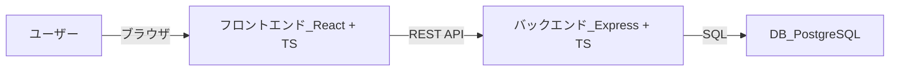
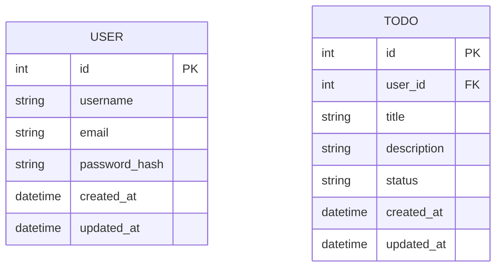
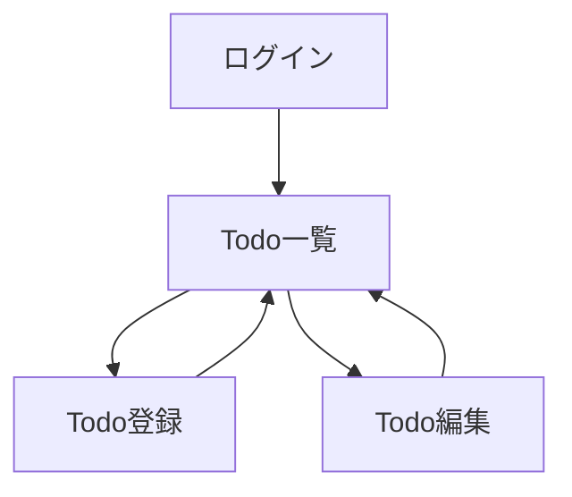

以下では、先ほどの「設計書」「手順書」をさらに初心者目線で補足・再整理した、  
**“100点” バージョン** のドキュメントを提示します。  

- 60点版 → ざっくりした構成や説明  
- 100点版 → 初学者でも迷いにくいように、一つひとつのステップを分かりやすく、より詳しく解説  

**ポイント**  
- 「なぜその設定をするのか」「どこを変更するのか」を丁寧に解説  
- 作業の順番を明確にし、トラブルシューティングのヒントも少し盛り込み  
- 誤字や脱字などがなく、正確さに配慮  

---


# 目次

1. [設計書 (初心者向け拡張版)](#設計書-初心者向け拡張版)  
   1.1 [プロジェクト概要](#11-プロジェクト概要)  
   1.2 [目的](#12-目的)  
   1.3 [機能概要](#13-機能概要)  
   1.4 [全体アーキテクチャ](#14-全体アーキテクチャ)  
   1.5 [要件定義](#15-要件定義)  
   1.6 [技術選定](#16-技術選定)  
   1.7 [ディレクトリ構成](#17-ディレクトリ構成)  
   1.8 [各コンポーネントの設計](#18-各コンポーネントの設計)  
   1.9 [DB スキーマ設計](#19-db-スキーマ設計)  
   1.10 [アプリケーション機能仕様](#110-アプリケーション機能仕様)  
   1.11 [インフラ構成](#111-インフラ構成)  
   1.12 [CI/CD パイプライン設計](#112-cicd-パイプライン設計)  
   1.13 [デプロイ戦略](#113-デプロイ戦略)  
   1.14 [セキュリティ・運用上の考慮](#114-セキュリティ運用上の考慮)  
   1.15 [今後の拡張方針](#115-今後の拡張方針)  

2. [手順書 (初心者向け拡張版)](#手順書-初心者向け拡張版)  
   2.1 [事前準備](#21-事前準備)  
   2.2 [開発環境構築手順](#22-開発環境構築手順)  
   2.3 [Docker 関連ファイルの準備](#23-docker-関連ファイルの準備)  
   2.4 [Docker Compose でサービス起動](#24-docker-compose-でサービス起動)  
   2.5 [実装手順の詳細](#25-実装手順の詳細)  
   2.6 [トラブルシューティングのヒント](#26-トラブルシューティングのヒント)  

---


# 設計書 (初心者向け拡張版)

## 1.1 プロジェクト概要

- **アプリ名**: MyTodoApp (仮)
- **想定するユーザー**: 自分含め、複数ユーザーがTodoを登録・管理できるウェブアプリを作る。  
- **特徴**: フロントエンド、バックエンド、データベースをコンテナ化 (Docker) して、スムーズに開発＆リリースが行える。

---

## 1.2 目的

- **React + TypeScript**: モダンフロントエンド開発を学ぶ  
- **Node.js + Express + TypeScript**: REST API・バックエンド開発を学ぶ  
- **Docker Compose**: マルチコンテナ構成 (フロント・バック・DB) をまとめて管理する練習  
- **GitHub Actions (CI/CD)**: プルリクやコミットのたびに自動テスト・ビルドを行い、品質を担保する練習  

---

## 1.3 機能概要

- **ユーザー管理**:  
  - サインアップ  
  - ログイン (JWT を利用)  
  - ログアウト (フロント側でトークン破棄)  
- **Todo CRUD**:  
  - 新規作成 (タイトル、詳細説明、ステータス)  
  - 一覧表示 (ログインユーザーの Todo に限る)  
  - 編集  
  - 削除  
- **ステータス管理**: TODO / DOING / DONE  
- **ユーザーごとの Todo 管理**: ログインしているユーザーだけが自分の Todo を見られる  

---

## 1.4 全体アーキテクチャ



- **フロントエンド (React)**: ブラウザ側で動く SPA (シングルページアプリ)  
- **バックエンド (Express)**: REST API サーバ、JWT 認証、データ管理など  
- **DB (PostgreSQL)**: ユーザーや Todo データを保存  

---

## 1.5 要件定義

### 機能要件
1. **ユーザー管理**  
   - サインアップ: 新規登録  
   - ログイン: JWT トークンを返す  
   - ログアウト: フロントエンドでトークンを削除
2. **Todo CRUD**  
   - 作成 / 一覧 / 詳細 / 更新 / 削除  
   - ステータス管理 (todo / doing / done など)
3. **認証・認可**  
   - JWT を利用  
   - ログインユーザーに紐付く Todo のみ操作可  

### 非機能要件
1. **セキュリティ**  
   - JWT シークレットキーの安全管理  
   - パスワードハッシュ (bcrypt)  
2. **拡張性**  
   - TypeScript + 分割されたディレクトリ構成  
3. **CI/CD**  
   - テスト & ビルドを自動化 (GitHub Actions)  

---

## 1.6 技術選定

| 区分          | 技術                         | 理由                                          |
|---------------|------------------------------|-----------------------------------------------|
| フロントエンド | React + TypeScript          | モダンフロント実装 & 型安全性                 |
| バックエンド   | Node.js + Express + TS      | 豊富なライブラリ, JSフルスタックの学習容易性   |
| データベース   | PostgreSQL                  | オープンソースで学習しやすく、Docker と相性良  |
| コンテナ管理   | Docker, Docker Compose       | ローカル開発から本番デプロイまで一貫性を保つ   |
| CI/CD         | GitHub Actions              | 無料枠あり & GitHub との相性が良い            |

---

## 1.7 ディレクトリ構成

```
todo-app/
  ├─ .gitignore
  ├─ .dockerignore
  ├─ docker-compose.yml
  ├─ frontend/
  │   ├─ Dockerfile
  │   ├─ package.json
  │   ├─ tsconfig.json
  │   ├─ public/
  │   └─ src/
  │       ├─ components/
  │       ├─ pages/
  │       ├─ hooks/
  │       ├─ services/
  │       ├─ types/
  │       ├─ App.tsx
  │       └─ main.tsx
  ├─ backend/
  │   ├─ Dockerfile
  │   ├─ package.json
  │   ├─ tsconfig.json
  │   └─ src/
  │       ├─ controllers/
  │       ├─ routes/
  │       ├─ models/
  │       ├─ middlewares/
  │       ├─ types/
  │       ├─ app.ts
  │       └─ server.ts
  └─ db/
      └─ (PostgreSQLデータ格納用 Volume)
```

**ポイント**  
- `frontend/` と `backend/` の両方で TypeScript を利用  
- `db/` ディレクトリは PostgreSQL のデータ保存 (Volume 用)。ソース管理外にしても良い  

---

## 1.8 各コンポーネントの設計

### フロントエンド (React + TS)

- **`public/`**: index.html など静的ファイル  
- **`src/`**:
  - **`components/`**: 小単位の UI 部品 (ボタン、入力欄など)  
  - **`pages/`**: 画面単位のコンポーネント (例: LoginPage, TodoListPage)  
  - **`hooks/`**: React のカスタムフック  
  - **`services/`**: API 呼び出し、認証ロジックなど  
  - **`types/`**: 型定義 (interface, type)  
  - **`App.tsx`**: ルーティングや主要画面切り替え  
  - **`main.tsx`**: React アプリのエントリーポイント  

### バックエンド (Express + TS)

- **`controllers/`**: ビジネスロジックや API の返却処理  
- **`routes/`**: ルーティング定義 (`GET /todos`, `POST /todos` etc.)  
- **`models/`**: DB へのアクセス (ORM, SQL 実行など)  
- **`middlewares/`**: JWT 検証やエラー処理などの共通処理  
- **`app.ts`**: Express インスタンス生成、ミドルウェア設定  
- **`server.ts`**: ポートを Listen してサーバ起動  

---

## 1.9 DB スキーマ設計



| テーブル名 | カラム名      | 型         | 概要                  |
|------------|--------------|------------|-----------------------|
| user       | id (PK)      | int        | ユーザID (主キー)     |
|            | username     | varchar    | ユーザ名              |
|            | email        | varchar    | メールアドレス        |
|            | password_hash| varchar    | パスワードハッシュ     |
|            | created_at   | datetime   | 作成日時              |
|            | updated_at   | datetime   | 更新日時              |
| todo       | id (PK)      | int        | Todo ID (主キー)      |
|            | user_id (FK) | int        | userテーブルの外部キー|
|            | title        | varchar    | Todoタイトル          |
|            | description  | text       | 詳細説明              |
|            | status       | varchar    | ステータス (todo 等)  |
|            | created_at   | datetime   | 作成日時              |
|            | updated_at   | datetime   | 更新日時              |

---

## 1.10 アプリケーション機能仕様

### 画面遷移図



- **ログイン画面**  
  - メール & パスワードを入力し JWT を取得 (成功時 Todo一覧画面へ)  
  - サインアップ導線がある場合、同画面 or 別画面でユーザー登録  
- **Todo 一覧画面**  
  - ログインユーザーの Todo 一覧  
  - 新規作成ボタン → Todo登録画面  
  - 編集ボタン → Todo編集画面  
  - 削除ボタン → Todoを削除  
- **Todo 登録画面**  
  - タイトル、説明、ステータスを入力し登録  
- **Todo 編集画面**  
  - 既存 Todo を編集  

### API 仕様例

| HTTP Method | エンドポイント | 説明                   | リクエスト例                                                                            | レスポンス例                                                      |
|-------------|---------------|------------------------|-----------------------------------------------------------------------------------------|-------------------------------------------------------------------|
| POST        | /auth/signup  | 新規ユーザー登録       | `{ "username": "aaa", "email": "a@a.com", "password": "pass" }`                         | 200 OK, `{ "message": "User created" }`                           |
| POST        | /auth/login   | ログイン(JWT取得)      | `{ "email": "a@a.com", "password": "pass" }`                                           | 200 OK, `{ "token": "<jwt_token>" }`                              |
| GET         | /todos        | Todo 一覧 (ユーザー毎)  | Header: `Authorization: Bearer <jwt>`                                                  | 200 OK, `[{"id":1,"title":"foo","status":"todo",...}, ...]`       |
| GET         | /todos/:id    | Todo 詳細              | Header: `Authorization: Bearer <jwt>`                                                  | 200 OK, `{"id":1,"title":"foo","status":"todo",...}`              |
| POST        | /todos        | Todo 作成              | Header: `Authorization: Bearer <jwt>`, Body: `{"title":"foo","description":"bar"}`      | 201 Created, `{"id":1,"title":"foo","description":"bar",...}`     |
| PUT         | /todos/:id    | Todo 更新              | Header: `Authorization: Bearer <jwt>`, Body: `{"title":"foo2","status":"doing"}`        | 200 OK, `{"message":"Todo updated"}`                              |
| DELETE      | /todos/:id    | Todo 削除              | Header: `Authorization: Bearer <jwt>`                                                  | 200 OK, `{"message":"Todo deleted"}`                              |

---

## 1.11 インフラ構成

- **Docker Compose** で以下 3 コンテナを起動  
  1. **frontend** (React)  
  2. **backend** (Express)  
  3. **db** (PostgreSQL)

### Docker Compose 構成 (例)

```yaml
version: '3.8'
services:
  frontend:
    build: ./frontend
    ports:
      - "3000:3000"
    volumes:
      - ./frontend:/app
    depends_on:
      - backend
    environment:
      - REACT_APP_API_URL=http://localhost:4000
  backend:
    build: ./backend
    ports:
      - "4000:4000"
    volumes:
      - ./backend:/app
    depends_on:
      - db
    environment:
      - DB_HOST=db
      - DB_USER=postgres
      - DB_PASSWORD=postgres
      - DB_NAME=postgres
      - DB_PORT=5432
  db:
    image: postgres:15-alpine
    container_name: mytodo_db
    environment:
      - POSTGRES_USER=postgres
      - POSTGRES_PASSWORD=postgres
    ports:
      - "5432:5432"
    volumes:
      - my-postgres-volume:/var/lib/postgresql/data
volumes:
  my-postgres-volume:
```

---

## 1.12 CI/CD パイプライン設計

- **GitHub Actions** での例

```yaml
# .github/workflows/ci.yml
name: CI

on:
  push:
    branches: ["main"]

jobs:
  build-and-test:
    runs-on: ubuntu-latest

    steps:
      - name: Check out the repo
        uses: actions/checkout@v2

      - name: Set up Node
        uses: actions/setup-node@v2
        with:
          node-version: 18

      - name: Build & Test Frontend
        run: |
          cd frontend
          npm install
          npm run build
          npm run test

      - name: Build & Test Backend
        run: |
          cd backend
          npm install
          npm run build
          npm test

      - name: Docker Build & Push
        uses: docker/build-push-action@v2
        with:
          context: ./backend
          tags: ghcr.io/${{ github.repository }}/mytodoapp-backend:latest
          push: true
```

---

## 1.13 デプロイ戦略

1. **開発環境 (local)**  
   - `docker-compose up --build` でローカル起動  
   - フロント → http://localhost:3000  
   - バックエンド → http://localhost:4000  
   - DB → ポート 5432

2. **ステージング/本番**  
   - ECS/Fargate / Azure / Google Cloud Run など  
   - VPS (Lightsail 等) に Docker Compose 配置  
   - IaC (Terraform 等) でインフラ構築の自動化も検討  

---

## 1.14 セキュリティ・運用上の考慮

1. **JWT シークレットキーの安全管理**  
   - `.env` ファイルに記載し、`.gitignore` で除外  
2. **パスワードのハッシュ化**  
   - bcrypt / argon2 などで必ずハッシュ化  
3. **HTTPS 化**  
   - 本番は SSL/TLS 化必須 (Nginx リバースプロキシやクラウド設定で実施)  
4. **ログ管理**  
   - morgan, winston など導入で監視性向上  
5. **バックアップ**  
   - DB の定期ダンプ (pg_dump など)、リモートストレージへ保管  
6. **Helmet, Rate-limit**  
   - HTTP ヘッダ強化、リクエスト制限  

---

## 1.15 今後の拡張方針

- UI/UX 向上: Material UI, Tailwind CSS, Chakra UI など導入  
- E2E テスト: Cypress / Playwright でユーザー操作テスト  
- プッシュ通知 or メール通知: 期限前にリマインド  
- ユーザーロール分け: 管理者 / 一般ユーザーなど権限制御  
- SSR や Next.js への切り替えも視野に  

---


# 手順書 (初心者向け拡張版)

ここでは、**実際に開発環境を構築し、アプリを起動するまで** の一連の流れを、初学者でもなるべく詰まらないよう丁寧に解説します。

## 2.1 事前準備

1. **Node.js** がインストールされていること (推奨バージョン: 18系)  
   - インストール確認: `node -v` で 18.x.x と表示されれば OK  
2. **npm** もしくは **yarn** が使える状態  
   - `npm -v` などで確認  
3. **Docker Desktop** (もしくは Docker Engine) をインストール  
   - `docker -v` でバージョンが表示されれば OK  
4. **Git** (必要に応じて)  
   - `git --version` でバージョン確認  

---

## 2.2 開発環境構築手順

以下、ローカルマシン上でコマンドを実行していきます。

1. **プロジェクト用ディレクトリを作成**  
   ```bash
   mkdir todo-app
   cd todo-app
   ```
2. **Gitリポジトリ初期化 (任意)**  
   ```bash
   git init
   ```
3. **フロントエンド作成 (create-react-app で React + TypeScript)**  
   ```bash
   npx create-react-app frontend --template typescript
   ```
   - これにより `frontend` ディレクトリが自動生成され、React + TS の初期セットアップ完了。  
4. **バックエンド作成 (Express + TypeScript)**  
   ```bash
   mkdir backend
   cd backend
   npm init -y
   npm install express cors jsonwebtoken bcrypt dotenv pg
   npm install -D typescript ts-node @types/express @types/node @types/cors @types/jsonwebtoken @types/bcrypt
   npx tsc --init
   cd ..
   ```
   - `backend` フォルダ内に `package.json` や `tsconfig.json` が生成される。  

---

## 2.3 Docker 関連ファイルの準備

### 2.3.1 `.gitignore` の整備

- **目的**: コミット不要なファイル (node_modules など) を除外する  
- `todo-app` 直下に `.gitignore` を作り、以下を例示して追記  

```bash
# Node関連
node_modules/
npm-debug.log
yarn.lock
package-lock.json

# TypeScriptビルド成果物
dist/
build/
*.js
*.d.ts

# Docker関連
docker-compose.override.yml

# OS/IDE
.DS_Store
.vscode/
.idea/

# 環境変数ファイル
.env
.env.*
```

### 2.3.2 `.dockerignore` の整備

- **目的**: Docker イメージに含めなくていいものを除外する  
- `todo-app` 直下に `.dockerignore` を作り、以下を例示して追記  

```bash
node_modules
npm-debug.log
yarn-error.log
package-lock.json
dist
build
.git
.gitignore
.DS_Store
.vscode
.idea
.env
*.log
```

### 2.3.3 `docker-compose.yml` 作成 (例)

```yaml
version: '3.8'
services:
  frontend:
    build: ./frontend
    ports:
      - "3000:3000"
    volumes:
      - ./frontend:/app
    depends_on:
      - backend
    environment:
      - REACT_APP_API_URL=http://localhost:4000

  backend:
    build: ./backend
    ports:
      - "4000:4000"
    volumes:
      - ./backend:/app
    depends_on:
      - db
    environment:
      - DB_HOST=db
      - DB_USER=postgres
      - DB_PASSWORD=postgres
      - DB_NAME=postgres
      - DB_PORT=5432

  db:
    image: postgres:15-alpine
    container_name: mytodo_db
    environment:
      - POSTGRES_USER=postgres
      - POSTGRES_PASSWORD=postgres
    ports:
      - "5432:5432"
    volumes:
      - my-postgres-volume:/var/lib/postgresql/data

volumes:
  my-postgres-volume:
```

---

## 2.4 Docker Compose でサービス起動

```bash
# todo-appディレクトリ内で
docker-compose up --build
```

- 初回はイメージをビルドするため時間がかかる。  
- すべてのサービスが立ち上がると、ログに
```
frontend_1  | Compiled successfully!
backend_1   | Server running on port 4000
db          | PostgreSQL init process complete; ready for start up.
...
```
のようなメッセージが出る。

- ビルド完了後、以下のURLで動作確認:  
  - フロントエンド: http://localhost:3000  
  - バックエンド: http://localhost:4000 (API)  
  - DB: localhost の 5432番ポート (ローカルから直接アクセスするときに使う)  
- トラブルがあった場合 は、ログをよく見てどのコンテナがエラーを出しているか確認。
- 停止方法: Ctrl + C でコンテナを停止。

---

## 2.5 実装手順の詳細

### 2.5.1 バックエンド (Express + TypeScript)

#### (1) ディレクトリ構成

```
backend/
  ├─ Dockerfile
  ├─ package.json
  ├─ tsconfig.json
  └─ src/
      ├─ controllers/
      ├─ routes/
      ├─ models/
      ├─ middlewares/
      ├─ app.ts
      └─ server.ts
```

#### (2) `src/db.ts` (DB 接続設定)

```typescript
// src/db.ts
import { Pool } from "pg";
import dotenv from "dotenv";

dotenv.config();

export const pool = new Pool({
  host: process.env.DB_HOST, 
  user: process.env.DB_USER,
  password: process.env.DB_PASSWORD,
  database: process.env.DB_NAME,
  port: Number(process.env.DB_PORT || 5432),
});
```

#### (3) `src/server.ts` (基本サーバ起動)

```typescript
// src/server.ts
import express from "express";
import cors from "cors";
import { json } from "body-parser";
import dotenv from "dotenv";

dotenv.config();

const app = express();
app.use(cors());
app.use(json());

// 簡易ルート
app.get("/", (req, res) => {
  res.send("Hello from the backend in TypeScript!");
});

const PORT = process.env.PORT || 4000;
app.listen(PORT, () => {
  console.log(`Server running on port ${PORT}`);
});
```

#### (4) バックエンド用 Dockerfile (例)

```dockerfile
# backend/Dockerfile
FROM node:18-alpine
WORKDIR /app
COPY package*.json ./
RUN npm install
COPY . .
EXPOSE 4000
CMD ["npx", "ts-node", "src/server.ts"]
```

---

### 2.5.2 フロントエンド (React + TypeScript)

#### (1) ディレクトリ構成

```
frontend/
  ├─ Dockerfile
  ├─ package.json
  ├─ tsconfig.json
  ├─ public/
  └─ src/
      ├─ components/
      ├─ pages/
      ├─ hooks/
      ├─ services/
      ├─ types/
      ├─ App.tsx
      └─ main.tsx
```

#### (2) `src/services/api.ts` (axios 設定の例)

```typescript
// src/services/api.ts
import axios from "axios";

const apiClient = axios.create({
  baseURL: process.env.REACT_APP_API_URL || "http://localhost:4000",
});

apiClient.interceptors.request.use((config) => {
  const token = localStorage.getItem("token");
  if (token && config.headers) {
    config.headers.Authorization = `Bearer ${token}`;
  }
  return config;
});

export default apiClient;
```

#### (3) `src/App.tsx` や `src/pages/` 内での利用

- `/todos` などの API 呼び出しを `apiClient` で行い、データを表示・更新  

#### (4) フロントエンド用 Dockerfile (例)

```dockerfile
# frontend/Dockerfile
FROM node:18-alpine
WORKDIR /app
COPY package*.json ./
RUN npm install
COPY . .
EXPOSE 3000
CMD ["npm", "start"]
```

---

## 2.6 トラブルシューティングのヒント

1. **Docker が起動しない**  
   - Docker Desktop が立ち上がっているか確認。  
   - Windows なら WSL2 の設定が有効か。  
2. **ポート競合エラー**  
   - 既に他のプロセスが 3000/4000 ポートを使用していないか確認。  
3. **DB 接続でエラー**  
   - `.env` などの DB_HOST, DB_USER, DB_PASSWORD が正しいか見直す (Docker Compose の environment と一致しているか)。  
4. **JWT 認証で 401 エラー**  
   - トークンを取得していない / Authorization ヘッダを付与していない可能性  
   - localStorage への保存や、リクエスト時に付け忘れがないか確認。  
5. **React App が API を叩けない**  
   - `REACT_APP_API_URL` が正しく設定されているか  
   - CORS ポリシー設定 (バックエンドで `cors()` を使う) が有効か  

---


## （最後に）  

- **以上が初心者向けに詳細化した “100点” バージョンの設計書 & 手順書** です。  
- 手順を順番どおりに実行すれば、Webアプリが問題なく立ち上がるはずです。  
- もし途中でわからない点が出てきたら、**「どのステップまでできたか」「どこでエラーが出たか」** を確認しつつ、上記のトラブルシューティングを参考に原因を切り分けてみてください。  
- さらに学習を続ける場合は、認証周りの仕組み (JWT の仕組みやセキュリティ概念)、Docker のネットワーク設定、CI/CD の高度な設定なども深堀りしていくとスキルアップにつながります。  

---

これで開発をスタートし、学習の糧にしていただければ幸いです。  
**頑張ってください！**